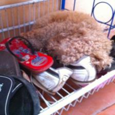

# Image captioning with attention

Generate image captions with CNN and RNN in pytorch

## Introduction

Image captioning is a very interesting topic, it just requires a little bit modification of the seq2seq model.
Instead of using RNN as encoder, it uses a pre-trained CNN to extract features from images. However, I have always thought about
how to show attention on image, as image information is encoded in a CNN network. I have found some codes that use all layers of a pre-trained network,
except the final layer to output classification result. But it is difficult to visualize attention using such a CNN encoder, which does not allow us 
to get the location info back? The author of the paper: Show attend and tell used lower layer of the pre-trained CNN model. So in this project, I use 
a conv output as the feature of the image. 
 

## Methodology

1. Prepare data for the model (Coco: http://cocodataset.org/#download  All 2014 data)
2. Load a pre-trained vgg-19 model
3. Build an attention decoder with GRU
4. Train the model with or without teacher forcing
5. Evaluate the model and visualize attention
Note: the learning rate should be very low in this case.

## Result
Ground Truth:  a shoe rack with some shoes and a dog sleeping on them  
Output:  a shoe rack with some shoes and a dog sleeping on them  
Ground Truth:  the back tire of an old style motorcycle is resting in a metal stand .  
Output:  a white with a white beard and a television  
Ground Truth:  a puppy rests on the street next to a bicycle .  
Output:  a puppy rests on the street next to a bicycle .  
Ground Truth:  bunk bed with a narrow shelf sitting underneath it .  
Output:  bunk bed with a narrow shelf sitting underneath it .  
Ground Truth:  a giraffe in a enclosed area is watched by some people  
Output:  a giraffe in a enclosed area is watched by some people  

a shoe rack with some shoes and a dog sleeping on them  

## References:
https://github.com/ntrang086/image_captioning/blob/master/2_Training.ipynb  
https://github.com/parksunwoo/show_attend_and_tell_pytorch  
http://proceedings.mlr.press/v37/xuc15.pdf  
